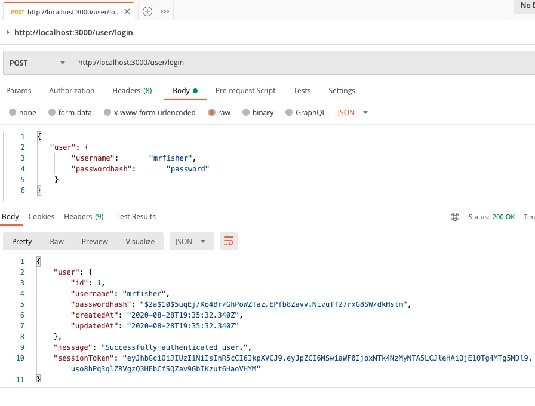
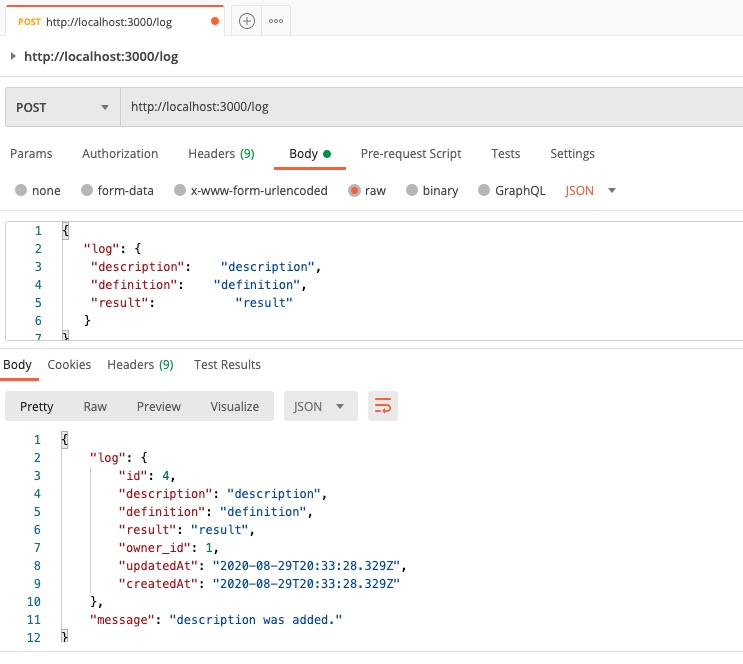
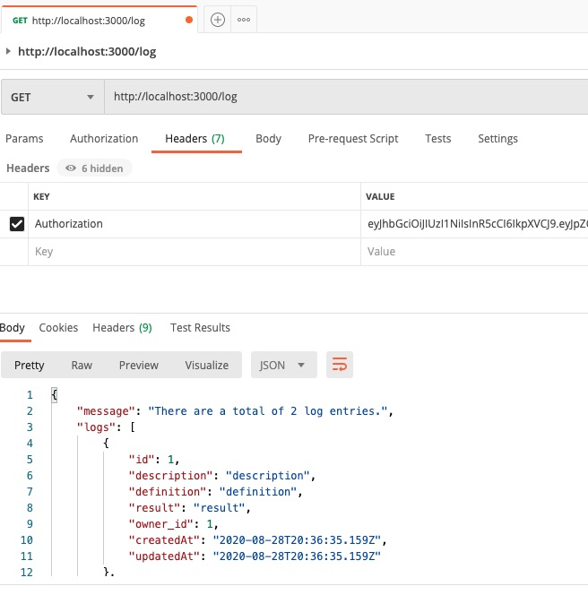
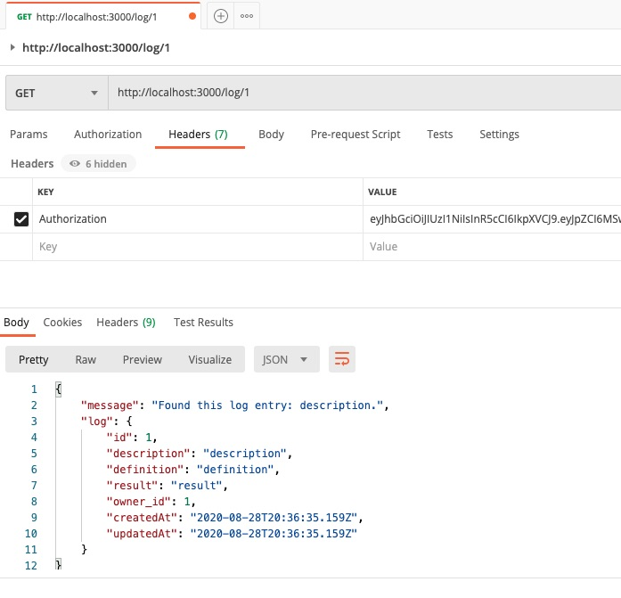
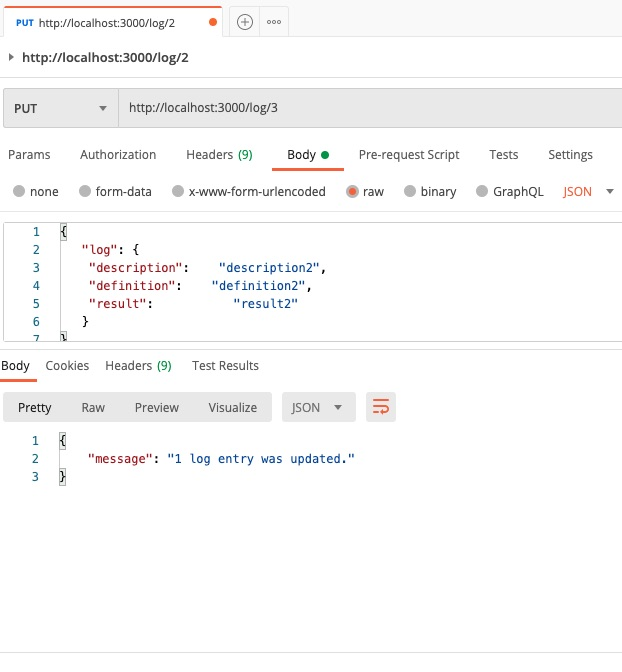
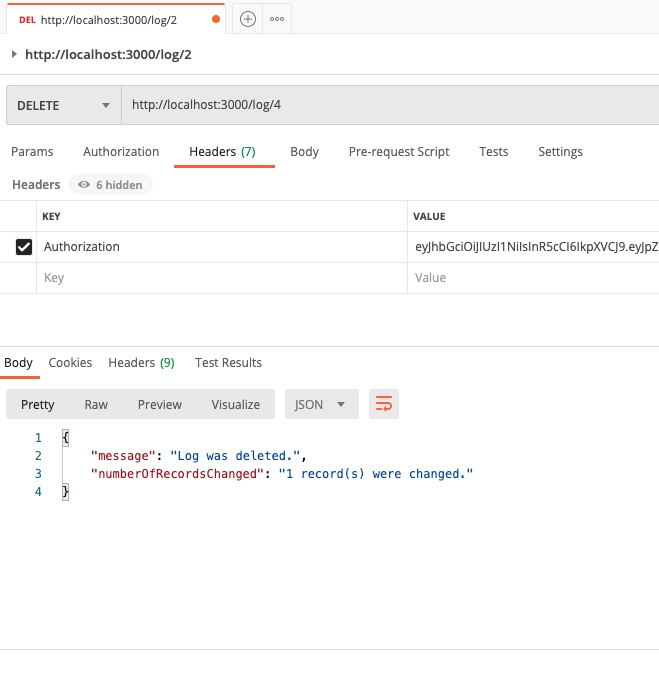

# Workout Log Server

Endpoint | Verb | Tested Screenshot
------------ | ------------- | -------------
/user/register | POST | 
/user/login | POST |  
/log/ | POST |  
/log/ | GET |  
/log/:id | GET |  
/log/:id | PUT |  
/log/:id | DELETE |  